# MAPS Architecture Documentation

This document provides comprehensive architecture diagrams and explanations of the MAPS system.

## Table of Contents

1. [System Overview](#system-overview)
2. [Service Architecture](#service-architecture)
3. [Data Flow Diagrams](#data-flow-diagrams)
4. [Authentication Flow](#authentication-flow)
5. [Scenario Pipeline](#scenario-pipeline)
6. [Circuit Breaker Pattern](#circuit-breaker-pattern)

---

## System Overview

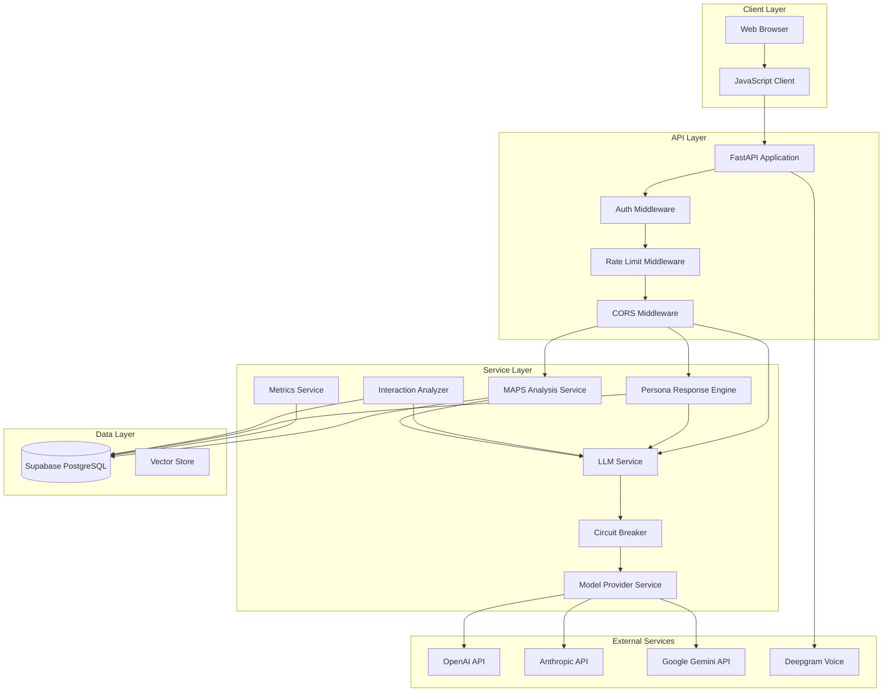

### Component Descriptions

| Component | Purpose | Technology |
|-----------|---------|------------|
| **FastAPI** | Web framework and API endpoints | FastAPI |
| **Auth Middleware** | JWT validation and route protection | Custom + PyJWT |
| **Rate Limit Middleware** | Request throttling and abuse prevention | Custom |
| **Circuit Breaker** | LLM provider resilience | Custom implementation |
| **LLM Service** | Unified interface for all LLM providers | OpenAI, Anthropic, Gemini SDKs |
| **Model Provider Service** | Multi-provider failover | Custom |
| **Persona Response Engine** | Generates authentic persona responses | LLM-based |
| **MAPS Analysis Service** | Person-centered coaching analysis | LLM + Pydantic |
| **Metrics Service** | System metrics collection | Supabase |

---

## Service Architecture

### LLM Provider Chain with Circuit Breaker

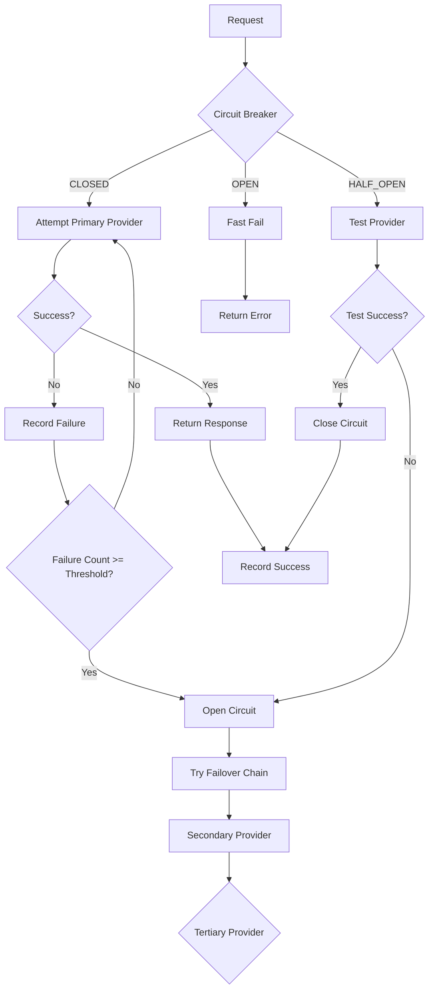

### Provider Failover Chain

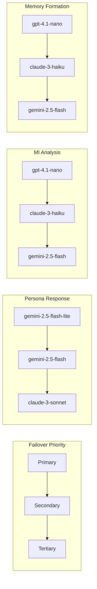

---

## Data Flow Diagrams

### Scenario Training Flow

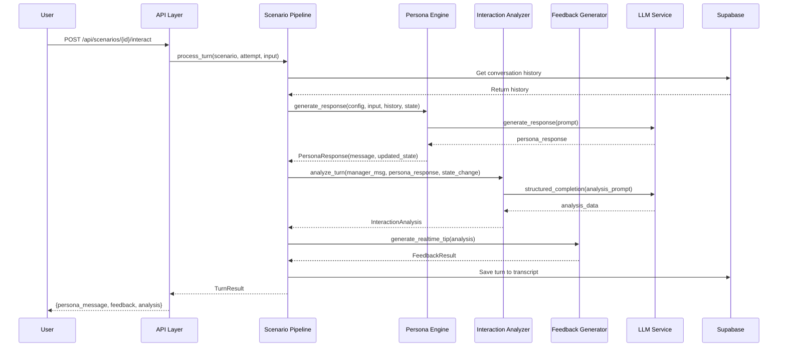

### MAPS Analysis Flow

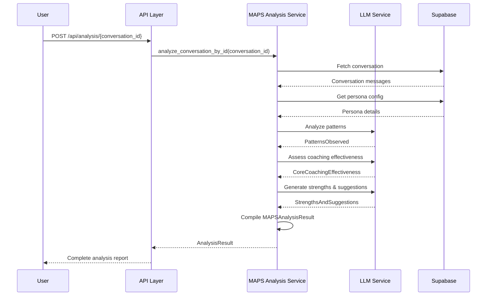

### Authentication Flow

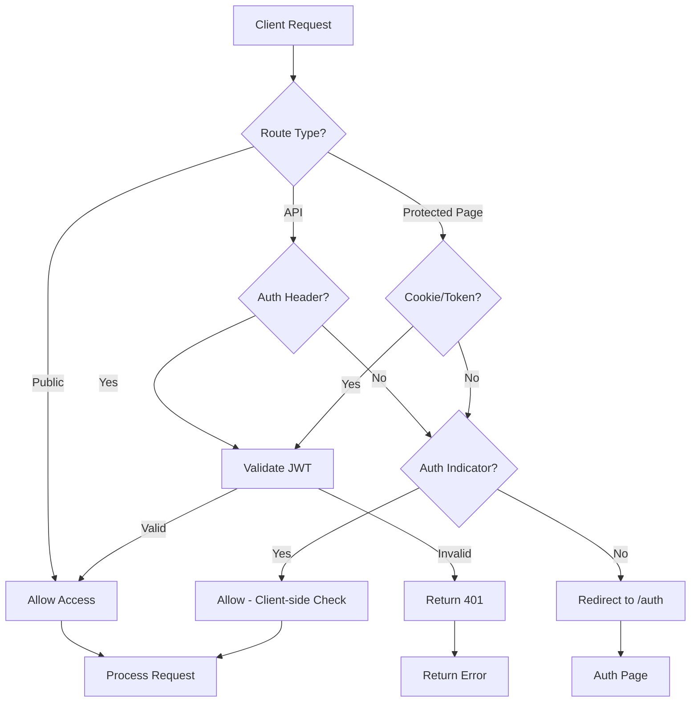

---

## Scenario Pipeline

### State Management

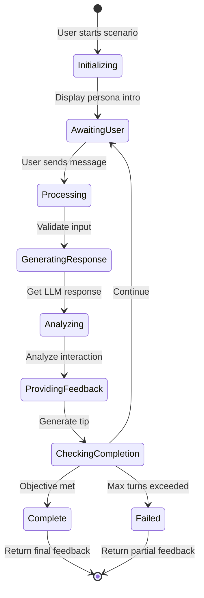

### Trust Level Evolution

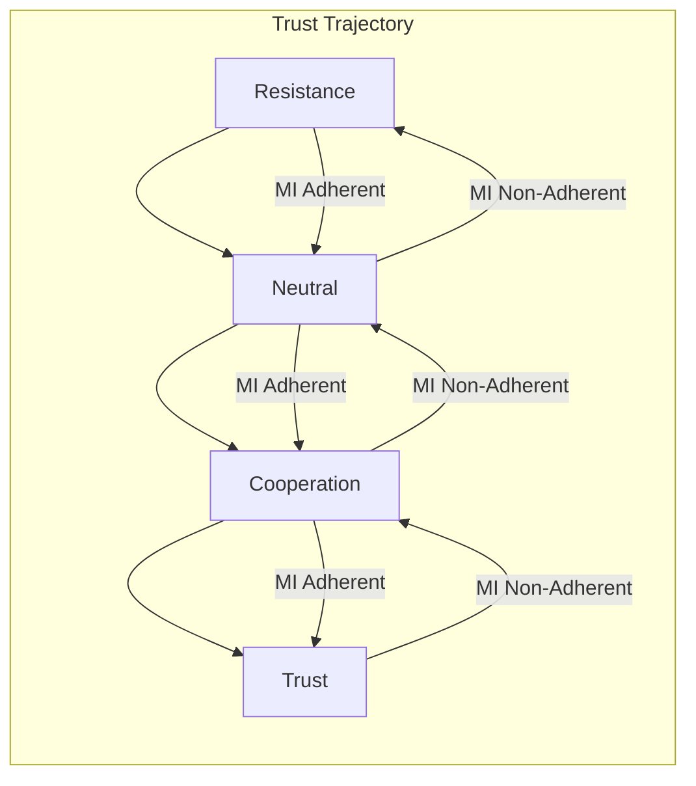

---

## Circuit Breaker Pattern

### State Machine

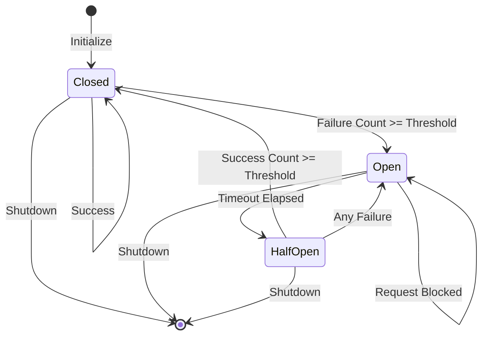

### Configuration per Provider

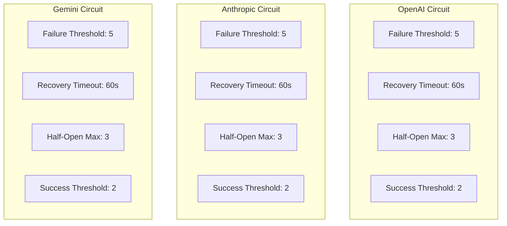

---

## Rate Limiting Strategy

### Request Flow

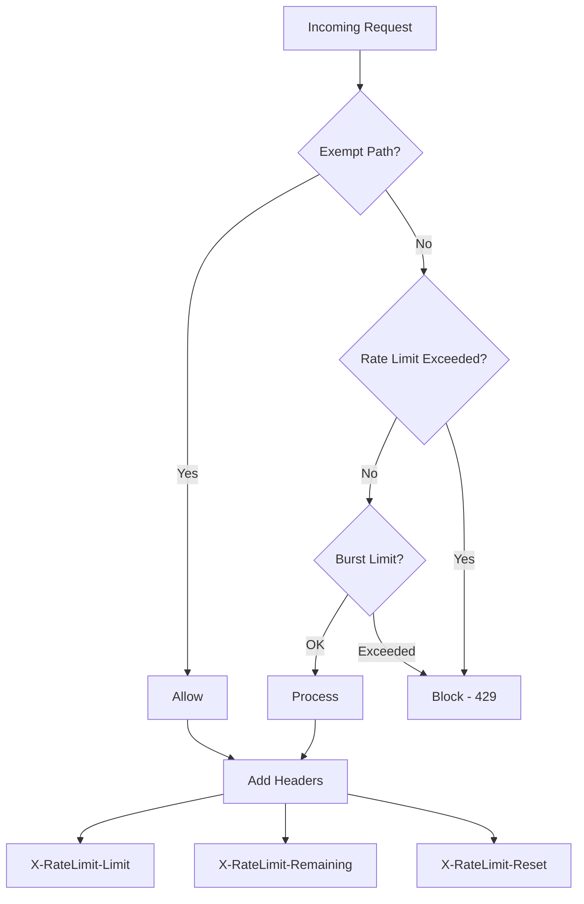

### Limits by Endpoint Type

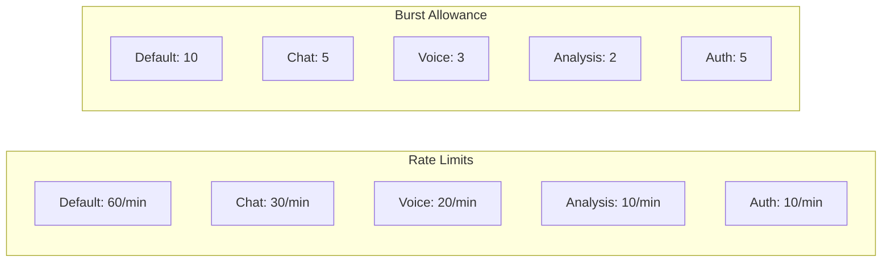

---

## Database Schema (Simplified)

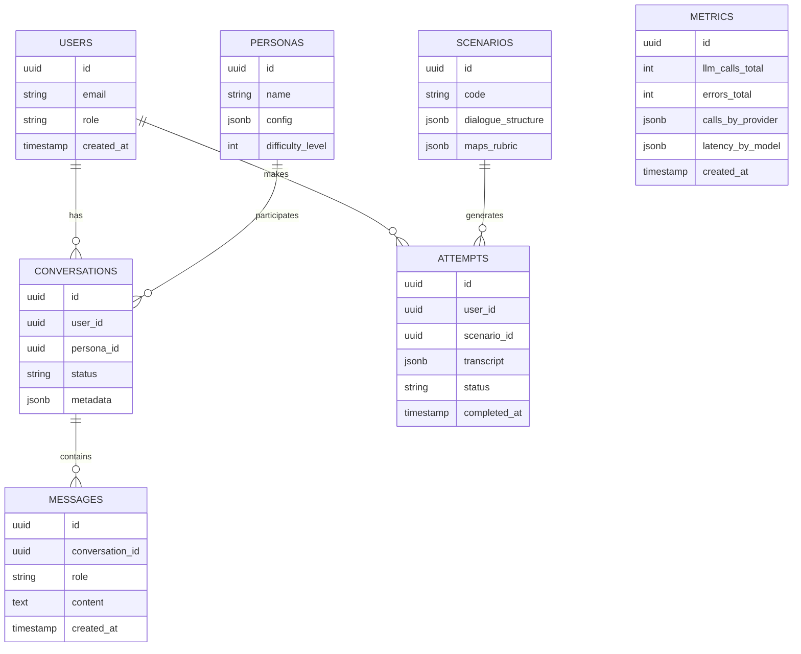

---

## Deployment Architecture

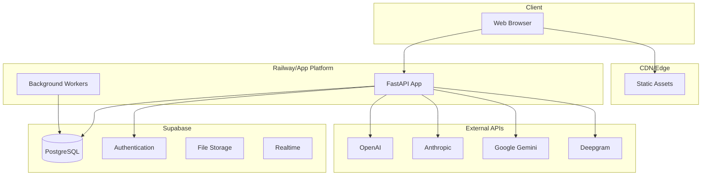

---

*Last Updated: 2026-02-02*
