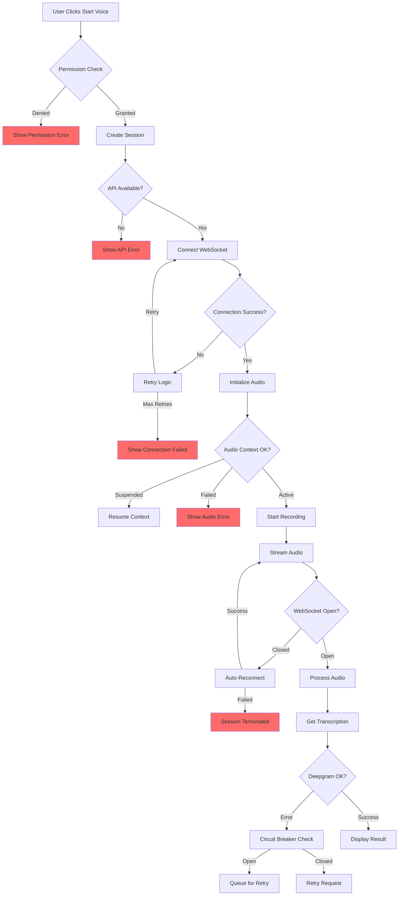

# Voice System Production Analysis

**Date:** 2026-02-02  
**Scope:** Deepgram Voice Integration, WebSocket Audio Streaming, Production Readiness  
**Status:** ⚠️ CRITICAL ISSUES IDENTIFIED

---

## Executive Summary

The voice system has several critical production issues that could cause failures in a live environment. The main concerns are:

1. **No automatic reconnection** for WebSocket failures
2. **Sample rate mismatches** between Flux STT (16kHz) and Voice Agent (24kHz)
3. **Memory leaks** from uncleared sessions and audio contexts
4. **Missing error recovery** in the event handlers
5. **No circuit breaker** for Deepgram API failures
6. **Browser compatibility gaps** without proper fallbacks

---

## 1. Critical Issues

### 1.1 WebSocket No Reconnection Logic ❌

**Location:** [`static/js/voice-client.js`](static/js/voice-client.js:177)

```javascript
this.websocket.onerror = (error) => {
    console.error('WebSocket error:', error);
    this._handleError(error);  // Just logs, no reconnection
};

this.websocket.onclose = () => {
    console.log('WebSocket closed');
    this._setStatus('idle');  // No reconnection attempt
};
```

**Problem:** If the WebSocket disconnects (network blip, server restart, timeout), the voice session is dead. User must manually restart.

**Impact:** High - Users will experience dropped voice sessions requiring manual intervention.

**Recommendation:**
```javascript
// Add reconnection logic with exponential backoff
this.websocket.onclose = (event) => {
    if (!this._intentionalClose && this._reconnectAttempts < this.CONSTANTS.MAX_RETRIES) {
        this._scheduleReconnect();
    }
};
```

---

### 1.2 Sample Rate Configuration Mismatch ❌

**Locations:**
- [`src/services/flux_stt_service.py`](src/services/flux_stt_service.py) - Uses Flux at 16kHz
- [`src/services/voice_gateway.py`](src/services/voice_gateway.py:152) - Voice Agent at 24kHz
- [`static/js/voice-client.js`](static/js/voice-client.js:42) - Default 16kHz

**Problem:** Per Deepgram documentation:
- **Flux STT**: Requires `/v2/listen` with `linear16` at **16000 Hz**
- **Voice Agent**: Uses `linear16` at **24000 Hz**

The voice client always uses 16kHz but Voice Agent mode expects 24kHz.

**Impact:** High - Audio quality issues, transcription errors, or complete failure in Voice Agent mode.

**Recommendation:** Dynamically set sample rate based on mode:
```javascript
const sampleRate = mode === 'full' ? 24000 : 16000;
```

---

### 1.3 Memory Leaks in Session Management ❌

**Location:** [`src/services/voice_gateway.py`](src/services/voice_gateway.py:135)

```python
self.sessions: Dict[str, VoiceSessionState] = {}
self.connections: Dict[str, Any] = {}
self.callbacks: Dict[str, Dict[str, Callable]] = {}
```

**Problem:** Sessions are added but never removed. In production with many users, this will cause memory exhaustion.

**Impact:** Critical - Server will run out of memory over time.

**Recommendation:** Implement session cleanup:
```python
# Add TTL and cleanup task
async def _cleanup_expired_sessions(self):
    """Remove sessions older than max_age"""
    cutoff = time.time() - self.SESSION_MAX_AGE
    expired = [sid for sid, state in self.sessions.items() 
               if state.session_start_ms / 1000 < cutoff]
    for sid in expired:
        await self._cleanup_session(sid)
```

---

### 1.4 No Circuit Breaker for Deepgram ❌

**Location:** [`src/services/voice_gateway.py`](src/services/voice_gateway.py:129)

```python
self.client = DeepgramClient(api_key=self.api_key)
```

**Problem:** If Deepgram API is down or rate-limited, every request will fail and retry immediately, hammering the API.

**Impact:** High - Cascading failures, API quota exhaustion.

**Recommendation:** Integrate with existing circuit breaker:
```python
from src.services.circuit_breaker import circuit_registry

async def connect_session(self, session_id: str, ...):
    breaker = circuit_registry.get_breaker("deepgram")
    if not await breaker.can_execute():
        return False
    try:
        # ... connection logic ...
        await breaker.record_success()
    except Exception as e:
        await breaker.record_failure(e)
        raise
```

---

### 1.5 Improper Async Context Manager Usage ❌

**Location:** [`src/services/voice_gateway.py`](src/services/voice_gateway.py:298)

```python
connection.__enter__()  # Called directly, not using 'with'
```

**Problem:** `__enter__()` is meant for context managers (`with` statement). Calling it directly may not properly initialize resources.

**Impact:** Medium - Resource leaks, improper connection handling.

**Recommendation:**
```python
# Use proper context manager or explicit open method
connection = self.client.agent.v1.connect()
await connection.open()  # If async, or use proper context manager
```

---

### 1.6 Threading with Async - Dangerous Pattern ❌

**Location:** [`src/services/voice_gateway.py`](src/services/voice_gateway.py:302)

```python
listener_thread = threading.Thread(
    target=connection.start_listening,
    daemon=True
)
listener_thread.start()
```

**Problem:** Mixing threading with asyncio can cause issues with event loops and async resources.

**Impact:** Medium - Race conditions, event loop errors.

**Recommendation:** Use asyncio task instead:
```python
asyncio.create_task(connection.start_listening())
```

---

## 2. Medium Priority Issues

### 2.1 No Permission Pre-Check

**Location:** [`static/js/voice-client.js`](static/js/voice-client.js:214)

```javascript
this.mediaStream = await navigator.mediaDevices.getUserMedia({...})
```

**Problem:** No check if permissions were previously denied. User will get error without guidance.

**Recommendation:**
```javascript
// Check permissions first
const permission = await navigator.permissions.query({ name: 'microphone' });
if (permission.state === 'denied') {
    throw new Error('Microphone permission denied. Please enable in browser settings.');
}
```

---

### 2.2 Audio Context Not Resumed After Suspend

**Location:** [`static/js/voice-client.js`](static/js/voice-client.js:340)

Browsers suspend AudioContext when not in focus. It must be resumed:

```javascript
if (this.audioContext.state === 'suspended') {
    await this.audioContext.resume();
}
```

---

### 2.3 No Ping/Pong Keepalive

**Problem:** WebSocket connections can timeout due to inactivity. No keepalive mechanism.

**Recommendation:**
```javascript
// Send periodic ping
this._pingInterval = setInterval(() => {
    if (this.websocket?.readyState === WebSocket.OPEN) {
        this.websocket.send(JSON.stringify({ type: 'ping' }));
    }
}, 30000);
```

---

### 2.4 Error UI Not Updated

**Location:** [`static/chat.html`](static/chat.html:711)

```javascript
} catch (error) {
    console.error('Failed to start voice:', error);
    voiceStartBtn.disabled = false;  // Only button state, no user message
    voiceStopBtn.disabled = true;
}
```

**Problem:** Errors are only logged to console. Users see no feedback when voice fails.

**Recommendation:**
```javascript
} catch (error) {
    console.error('Failed to start voice:', error);
    voiceStatus.textContent = `Error: ${error.message}`;
    voiceStatus.className = 'voice-status voice-status-error';
    voiceStartBtn.disabled = false;
    voiceStopBtn.disabled = true;
}
```

---

## 3. Architecture Issues

### 3.1 Missing Rate Limiting on Voice Endpoints

Voice endpoints should have stricter rate limits:
- `/voice/sessions` - Create session
- `/voice/ws/{session_id}` - WebSocket connection
- `/voice/tts` - Text-to-speech

**Recommendation:** Add to rate limit config:
```python
"voice": {"rpm": 20, "burst": 3}  # More restrictive for expensive operations
```

---

### 3.2 No Session Timeout

Sessions can stay open indefinitely. Should auto-close after inactivity.

**Recommendation:**
```python
# In VoiceGateway
SESSION_TIMEOUT_SECONDS = 300  # 5 minutes

async def _check_session_timeouts(self):
    now = time.time()
    for sid, state in self.sessions.items():
        if state.last_activity_at:
            last_activity = datetime.fromisoformat(state.last_activity_at).timestamp()
            if now - last_activity > self.SESSION_TIMEOUT_SECONDS:
                await self.close_session(sid)
```

---

### 3.3 No Audio Format Validation

Frontend could send wrong audio format causing transcription failures.

**Recommendation:** Validate audio chunks:
```python
def _validate_audio_chunk(self, chunk: bytes) -> bool:
    """Validate audio chunk format"""
    # Check chunk size is reasonable (not too large/small)
    if len(chunk) < 100 or len(chunk) > 10000:
        logger.warning(f"Suspicious audio chunk size: {len(chunk)}")
        return False
    return True
```

---

## 4. Recommendations Summary

### Immediate (Before Production)

1. **Fix sample rate mismatch** - Use correct rate per mode
2. **Add session cleanup** - Prevent memory leaks
3. **Add WebSocket reconnection** - Handle network interruptions
4. **Add Deepgram circuit breaker** - Prevent cascading failures
5. **Fix async/threading issues** - Use proper asyncio patterns

### Short-term (Post-Launch)

1. Add permission pre-checks
2. Implement ping/pong keepalive
3. Add user-facing error messages
4. Implement session timeouts
5. Add audio format validation

### Monitoring Recommendations

1. Track WebSocket connection duration
2. Monitor session memory usage
3. Alert on Deepgram API error rates
4. Track microphone permission denials
5. Monitor audio quality metrics

---

## 5. Mermaid Diagram: Voice Flow with Failure Points



---

**End of Analysis**
