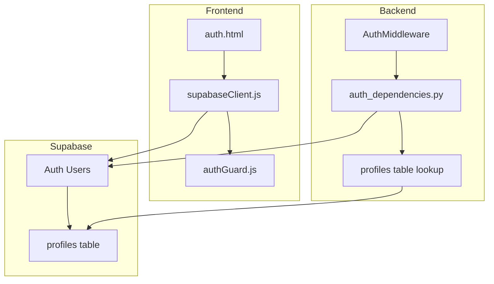
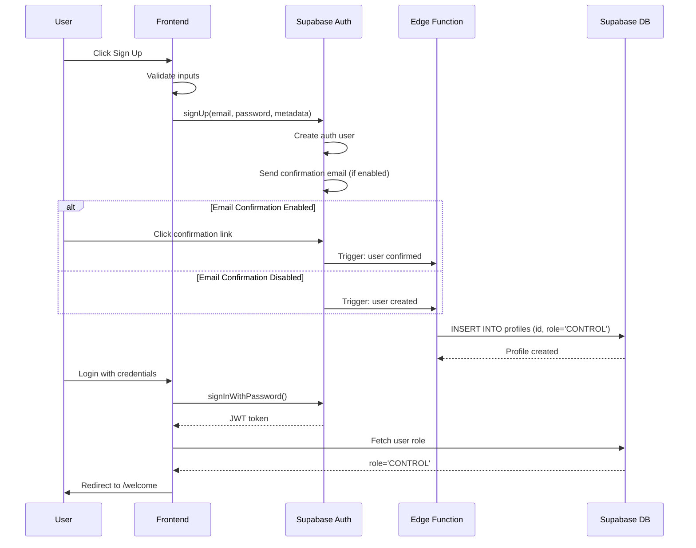

# Self-Registration Authentication Implementation Plan

## Executive Summary

This document outlines the implementation plan for enabling user self-registration via Supabase Auth in the MAPS application. The current system requires manual user creation by administrators. This plan enables automatic user registration with default CONTROL role assignment.

---

## 1. Current State Analysis

### 1.1 Authentication Architecture



### 1.2 Current Auth Flow

1. **Login Flow:**
   - User enters credentials in [`auth.html`](static/auth.html:306)
   - Frontend calls [`supabase.auth.signInWithPassword()`](static/auth.html:318)
   - On success, [`getUserRole()`](static/js/authGuard.js:39) fetches role from profiles table
   - User redirected to [`/welcome`](static/auth.html:338)

2. **Token Validation:**
   - Backend [`AuthMiddleware`](src/middleware/auth_middleware.py:17) validates JWT tokens
   - [`get_current_user()`](src/auth/auth_dependencies.py:33) verifies token with Supabase
   - User profile fetched from profiles table using RLS policies

3. **Current Signup State:**
   - Signup button is **disabled** with message "Sign up is managed by administrators"
   - Commented-out signup code exists in [`handleSignUp()`](static/auth.html:256)

### 1.3 Key Files Reviewed

| File | Purpose | Key Finding |
|------|---------|-------------|
| [`src/auth/auth_dependencies.py`](src/auth/auth_dependencies.py:1) | JWT validation & profile lookup | Expects profile to exist, returns 403 if missing |
| [`static/auth.html`](static/auth.html:1) | Login/signup UI | Signup disabled, code commented out |
| [`static/js/supabaseClient.js`](static/js/supabaseClient.js:1) | Supabase client initialization | Fetches config from `/api/config/supabase` |
| [`static/js/authGuard.js`](static/js/authGuard.js:1) | Auth guards & role checking | [`getUserRole()`](static/js/authGuard.js:39) expects profile with 'role' column |
| [`src/middleware/auth_middleware.py`](src/middleware/auth_middleware.py:1) | Server-side route protection | Validates JWT, redirects unauthenticated users |

---

## 2. Recommended Approach

### 2.1 High-Level Flow



### 2.2 Implementation Strategy

**Option A: Database Trigger (Recommended)**
- Use PostgreSQL trigger on `auth.users` table
- Automatically creates profile on user creation
- Simple, reliable, no external dependencies

**Option B: Supabase Edge Function**
- Use `auth.users` webhook to call Edge Function
- More flexible for complex logic
- Requires HTTP endpoint

**Selected Approach: Option A (Database Trigger)**
- Simpler to implement and maintain
- Atomic transaction (user + profile created together)
- No additional infrastructure needed

---

## 3. Database Schema Requirements

### 3.1 Profiles Table Structure

Based on code analysis, the profiles table must have:

```sql
-- Create table only if it doesn't exist
CREATE TABLE IF NOT EXISTS public.profiles (
    id UUID PRIMARY KEY REFERENCES auth.users(id) ON DELETE CASCADE,
    role VARCHAR(20) NOT NULL DEFAULT 'CONTROL',
    created_at TIMESTAMP WITH TIME ZONE DEFAULT NOW(),
    updated_at TIMESTAMP WITH TIME ZONE DEFAULT NOW()
);

-- Enable RLS (idempotent)
ALTER TABLE public.profiles ENABLE ROW LEVEL SECURITY;

-- RLS Policies (use CREATE OR REPLACE or check if exists)
DO $$
BEGIN
    -- Drop existing policies to avoid conflicts
    DROP POLICY IF EXISTS "Users can view own profile" ON public.profiles;
    DROP POLICY IF EXISTS "Users can update own profile" ON public.profiles;
    DROP POLICY IF EXISTS "Service role can insert profiles" ON public.profiles;
    
    -- Create policies
    CREATE POLICY "Users can view own profile"
        ON public.profiles FOR SELECT
        USING (auth.uid() = id);

    CREATE POLICY "Users can update own profile"
        ON public.profiles FOR UPDATE
        USING (auth.uid() = id);

    CREATE POLICY "Service role can insert profiles"
        ON public.profiles FOR INSERT
        WITH CHECK (true);
END $$;
```

### 3.2 Trigger Function

```sql
-- Function to create profile on user signup (idempotent)
CREATE OR REPLACE FUNCTION public.handle_new_user()
RETURNS TRIGGER AS $$
BEGIN
    -- Only insert if profile doesn't already exist
    INSERT INTO public.profiles (id, role)
    VALUES (NEW.id, 'CONTROL')
    ON CONFLICT (id) DO NOTHING;
    RETURN NEW;
END;
$$ LANGUAGE plpgsql SECURITY DEFINER;

-- Trigger on auth.users (idempotent)
DROP TRIGGER IF EXISTS on_auth_user_created ON auth.users;
CREATE TRIGGER on_auth_user_created
    AFTER INSERT ON auth.users
    FOR EACH ROW
    EXECUTE FUNCTION public.handle_new_user();
```

---

## 4. Frontend Changes Required

### 4.1 auth.html Modifications

1. **Enable Signup Button:**
   - Remove `disabled` attribute from signup button
   - Remove `style="opacity: 0.5; cursor: not-allowed;"`
   - Update button text to "Sign Up"

2. **Uncomment and Update handleSignUp():**

```javascript
async function handleSignUp() {
    const name = document.getElementById('name').value;
    const email = document.getElementById('email').value;
    const password = document.getElementById('password').value;
    
    if (!name || !email || !password) {
        showError('Please fill in all fields');
        return;
    }
    
    // Password validation
    if (password.length < 6) {
        showError('Password must be at least 6 characters');
        return;
    }

    try {
        showLoading('Creating account...');

        const { data, error } = await supabase.auth.signUp({
            email: email,
            password: password,
            options: {
                data: {
                    name: name
                }
            }
        });

        if (error) {
            throw error;
        }

        hideLoading();
        console.log('✅ Sign up successful:', data);
        
        // Check if email confirmation is required
        if (data.user && data.user.identities && data.user.identities.length > 0) {
            if (data.session) {
                // Auto-confirmed (email confirmation disabled)
                showSuccess('Account created! Redirecting...');
                setTimeout(() => {
                    window.location.href = '/welcome';
                }, 1500);
            } else {
                // Email confirmation required
                showSuccess('Account created! Please check your email to confirm.');
                document.getElementById('authForm').reset();
            }
        }

    } catch (error) {
        hideLoading();
        console.error('❌ Sign up error:', error);
        showError(error.message || 'Sign up failed. Please try again.');
    }
}
```

3. **Update Button HTML:**

```html
<div class="button-group">
    <button type="button" class="btn-auth btn-signup" onclick="handleSignUp()">
        Sign Up
    </button>
    <button type="button" class="btn-auth btn-login" onclick="handleLogIn()">
        Log In
    </button>
</div>
```

### 4.2 Email Confirmation Handling

If email confirmation is enabled in Supabase:

1. User signs up → Sees "Check your email" message
2. User clicks email link → Confirms account
3. Trigger fires → Profile created
4. User logs in → Normal flow proceeds

If email confirmation is disabled:

1. User signs up → Auto-confirmed
2. Trigger fires → Profile created
3. User automatically logged in → Redirected to welcome

---

## 5. Security Considerations

### 5.1 Authentication Security

| Concern | Mitigation |
|---------|------------|
| Weak passwords | Enforce minimum 6 characters (Supabase default), consider stronger requirements |
| Email verification | Recommend enabling email confirmation in production |
| Brute force attacks | Supabase built-in rate limiting on auth endpoints |
| Role escalation | Profile role defaults to 'CONTROL', only admins can upgrade to 'FULL' |
| SQL injection | Using Supabase client library with parameterized queries |

### 5.2 Database Security

```sql
-- Ensure trigger runs with proper privileges
-- SECURITY DEFINER runs as function owner (postgres)
-- This allows trigger to insert into profiles while respecting RLS

-- Additional safety: Prevent manual role escalation (idempotent)
CREATE OR REPLACE FUNCTION prevent_role_escalation()
RETURNS TRIGGER AS $$
BEGIN
    -- Only service role or admin can change to FULL
    IF NEW.role = 'FULL' AND OLD.role != 'FULL' THEN
        -- Check if current user is admin (implement your logic)
        -- For now, prevent any role escalation through normal updates
        RAISE EXCEPTION 'Role escalation not allowed through self-service';
    END IF;
    RETURN NEW;
END;
$$ LANGUAGE plpgsql;

-- Drop trigger if exists to avoid errors
DROP TRIGGER IF EXISTS prevent_role_escalation_trigger ON public.profiles;
CREATE TRIGGER prevent_role_escalation_trigger
    BEFORE UPDATE ON public.profiles
    FOR EACH ROW
    EXECUTE FUNCTION prevent_role_escalation();
```

### 5.3 Production Checklist

- [ ] Enable email confirmation in Supabase Auth settings
- [ ] Configure SMTP for email delivery
- [ ] Set up proper redirect URLs in Supabase Auth settings
- [ ] Review RLS policies for all tables
- [ ] Enable CAPTCHA on signup (optional)
- [ ] Monitor auth logs for suspicious activity

---

## 6. Implementation Steps

### Phase 1: Database Setup

1. **Create profiles table** (if not exists):
   ```bash
   # Run in Supabase SQL Editor
   ```
   SQL from section 3.1
   ```

2. **Create trigger function**:
   ```bash
   # Run in Supabase SQL Editor
   ```
   SQL from section 3.2
   ```

3. **Verify trigger works**:
   - Create test user in Supabase Auth UI
   - Check that profile row is auto-created

### Phase 2: Frontend Updates

1. **Update auth.html**:
   - Enable signup button
   - Uncomment and update `handleSignUp()` function
   - Add email confirmation handling

2. **Test signup flow**:
   - Test with email confirmation enabled
   - Test with email confirmation disabled
   - Verify profile created with CONTROL role

### Phase 3: Backend Verification

1. **Verify auth_dependencies.py works**:
   - Login with new user
   - Confirm profile lookup succeeds
   - Verify CONTROL role is returned

2. **Test protected routes**:
   - Ensure middleware allows access
   - Verify role-based access control works

### Phase 4: Production Deployment

1. **Enable email confirmation** in Supabase dashboard
2. **Configure email templates** (optional)
3. **Set redirect URLs** in Supabase Auth settings
4. **Monitor logs** for any issues

---

## 7. Testing Strategy

### 7.1 Test Cases

| Test Case | Expected Result |
|-----------|----------------|
| Sign up with valid email/password | Account created, profile with CONTROL role |
| Sign up with existing email | Error: User already registered |
| Sign up with weak password | Error: Password too weak |
| Login after signup | Successful, redirected to /welcome |
| Access protected route without auth | Redirected to /auth |
| Access protected route with auth | Allowed access |
| Email confirmation flow | Email sent, confirmation works |

### 7.2 Manual Testing Steps

1. Open `/auth` page
2. Fill in name, email, password
3. Click Sign Up
4. Verify success message
5. Check Supabase profiles table for new row
6. Login with credentials
7. Verify redirect to `/welcome`

---

## 8. Migration Script

Create a reusable SQL migration file:

```sql
-- ============================================
-- Enable Self-Registration Migration
-- Run this in Supabase SQL Editor
-- ============================================

-- 1. Create profiles table if not exists
CREATE TABLE IF NOT EXISTS public.profiles (
    id UUID PRIMARY KEY REFERENCES auth.users(id) ON DELETE CASCADE,
    role VARCHAR(20) NOT NULL DEFAULT 'CONTROL',
    created_at TIMESTAMP WITH TIME ZONE DEFAULT NOW(),
    updated_at TIMESTAMP WITH TIME ZONE DEFAULT NOW()
);

-- 2. Enable RLS
ALTER TABLE public.profiles ENABLE ROW LEVEL SECURITY;

-- 3. Create RLS policies
DROP POLICY IF EXISTS "Users can view own profile" ON public.profiles;
CREATE POLICY "Users can view own profile" 
    ON public.profiles FOR SELECT 
    USING (auth.uid() = id);

DROP POLICY IF EXISTS "Users can update own profile" ON public.profiles;
CREATE POLICY "Users can update own profile" 
    ON public.profiles FOR UPDATE 
    USING (auth.uid() = id);

-- 4. Create trigger function (idempotent with conflict handling)
CREATE OR REPLACE FUNCTION public.handle_new_user()
RETURNS TRIGGER AS $$
BEGIN
    INSERT INTO public.profiles (id, role)
    VALUES (NEW.id, 'CONTROL')
    ON CONFLICT (id) DO NOTHING;
    RETURN NEW;
END;
$$ LANGUAGE plpgsql SECURITY DEFINER;

-- 5. Create trigger (idempotent)
DROP TRIGGER IF EXISTS on_auth_user_created ON auth.users;
CREATE TRIGGER on_auth_user_created
    AFTER INSERT ON auth.users
    FOR EACH ROW
    EXECUTE FUNCTION public.handle_new_user();

-- 6. Verify
SELECT 'Migration complete!' as status;
```

---

## 9. Rollback Plan

If issues occur:

1. **Disable signup button** (revert auth.html)
2. **Drop trigger** (if causing issues):
   ```sql
   DROP TRIGGER IF EXISTS on_auth_user_created ON auth.users;
   ```
3. **Clean up test users** if needed

---

## 10. Summary

This implementation enables user self-registration while maintaining security:

- **Database Trigger**: Automatically creates profile with CONTROL role
- **Frontend Updates**: Enable signup button and handle confirmation flow
- **Security**: RLS policies, role escalation prevention, email verification
- **No Backend Changes Required**: Current auth flow already supports this

The implementation is minimal, secure, and follows Supabase best practices.
