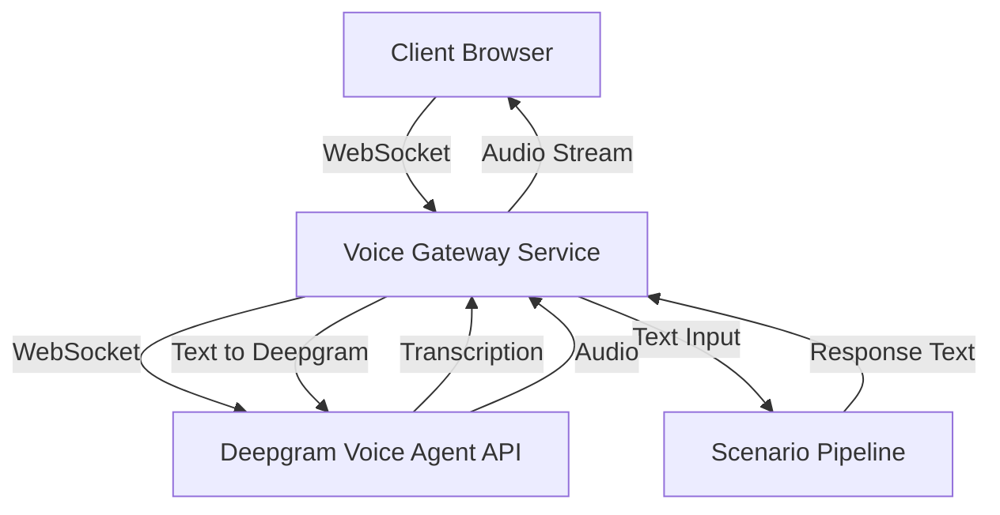

# Voice Integration Plan for Scenario-Based Training

## Overview

Add real-time speech-to-text (STT) and text-to-speech (TTS) capabilities to the scenario-based MI training platform using Deepgram's **Voice Agent API** and **Flux conversational speech recognition**.

## Deepgram Technologies Overview

### 1. Flux - Conversational Speech Recognition
**Flux** is Deepgram's first conversational speech recognition model built specifically for voice agents:
- Smart turn detection - Knows when speakers finish talking
- Ultra-low latency - ~260ms end-of-turn detection
- Early LLM responses - EagerEndOfTurn events for faster replies
- Turn-based transcripts - Clean conversation structure
- Natural interruptions - Built-in barge-in handling
- Nova-3 accuracy - Best-in-class transcription quality

**Flux Requirements:**
- Endpoint: `/v2/listen` (NOT `/v1/listen`)
- Model: `flux-general-en`
- Audio Format: linear16, 16000Hz recommended
- Chunk Size: 80ms audio chunks strongly recommended

### 2. Voice Agent API
The Voice Agent API provides a **unified voice agent** that combines:
- **Speech-to-Text (STT)**: Real-time streaming transcription
- **Text-to-Speech (TTS)**: Natural-sounding voice synthesis
- **LLM Integration**: Built-in conversational AI capabilities
- **WebSocket-based**: Single connection for bidirectional audio streaming

**Key Features:**
- Uses `deepgram-sdk` Python package
- WebSocket connection with event handlers
- Audio encoding: linear16, 24kHz sample rate
- Keep-alive messages every 5 seconds
- Automatic interruption handling

## Architecture



## Implementation Plan

### Phase 1: Backend Infrastructure

#### 1.1 Install Deepgram SDK

```bash
pip install deepgram-sdk
```

#### 1.2 Create Voice Gateway Service
**File:** `src/services/voice_gateway.py`

- WebSocket handler for real-time audio streaming
- Deepgram Voice Agent connection management
- Event handlers: `on_open`, `on_message`, `on_close`, `on_error`
- Audio buffering and chunking
- Keep-alive message handling (every 5 seconds)
- Connection lifecycle management

**Key Components:**
```python
from deepgram import DeepgramClient
from deepgram.core.events import EventType
from deepgram.extensions.types.sockets import (
    AgentV1Agent,
    AgentV1AudioConfig,
    AgentV1AudioInput,
    AgentV1AudioOutput,
)

# Connection
with client.agent.v1.connect() as connection:
    connection.send_settings(settings)
    # Handle audio streaming
```

**Event Types to Handle:**
- `Welcome` - Connection established
- `SettingsApplied` - Configuration confirmed
- `ConversationText` - Transcription received
- `UserStartedSpeaking` - User began talking
- `AgentThinking` - Agent processing response
- `AgentStartedSpeaking` - Agent began speaking
- `AgentAudioDone` - Agent finished speaking
- `Open`, `Close`, `Error` - Connection lifecycle

#### 1.3 Create Flux STT Service (Alternative/Complementary)
**File:** `src/services/flux_stt_service.py`

For scenarios requiring only speech-to-text without the full Voice Agent:

```python
from deepgram import AsyncDeepgramClient
from deepgram.core.events import EventType
from deepgram.extensions.types.sockets import ListenV2SocketClientResponse

# Connect to Flux
async with client.listen.v2.connect(
    model="flux-general-en",
    encoding="linear16",
    sample_rate="16000",
    # Flux-specific parameters
    eot_threshold=0.7,  # End-of-turn confidence (0.5-0.9)
    eager_eot_threshold=0.3,  # Early response threshold (0.3-0.9)
    eot_timeout_ms=5000,  # Silence timeout (500-10000ms)
) as connection:
    # Handle streaming transcription
```

**Flux Configuration Options:**
| Parameter | Range | Default | Description |
|-----------|-------|---------|-------------|
| `eot_threshold` | 0.5-0.9 | 0.7 | Confidence for end-of-turn detection |
| `eager_eot_threshold` | 0.3-0.9 | None | Early response trigger |
| `eot_timeout_ms` | 500-10000 | 5000 | Max silence before forced turn end |

#### 1.4 Create Voice Session Manager
**File:** `src/services/voice_session_manager.py`

- Manage active voice sessions
- Map sessions to scenario attempts
- Handle session state (listening, processing, speaking)
- Store conversation transcripts
- Handle interruptions and barge-in

### Phase 2: Database Schema Updates

**File:** `supabase/0017_voice_sessions.sql`

```sql
CREATE TABLE voice_sessions (
    id UUID PRIMARY KEY DEFAULT gen_random_uuid(),
    attempt_id UUID NOT NULL,
    user_id UUID NOT NULL,
    deepgram_session_id TEXT,
    started_at TIMESTAMP DEFAULT NOW(),
    ended_at TIMESTAMP NULL,
    duration_seconds INT DEFAULT 0,
    transcript JSONB DEFAULT '[]',
    audio_chunks_count INT DEFAULT 0,
    flux_config JSONB,  -- Store Flux-specific settings
    FOREIGN KEY (attempt_id) REFERENCES scenario_attempts(id) ON DELETE CASCADE
);

CREATE INDEX idx_voice_sessions_attempt ON voice_sessions(attempt_id);
CREATE INDEX idx_voice_sessions_user ON voice_sessions(user_id);
```

### Phase 3: API Endpoints

**File:** `src/api/routes/voice.py`

| Method | Endpoint | Description |
|--------|----------|-------------|
| POST | `/api/voice/session` | Create new voice session for scenario |
| GET | `/api/voice/session/{id}` | Get session status and transcript |
| WS | `/api/voice/ws/{session_id}` | WebSocket for real-time audio streaming |
| POST | `/api/voice/session/{id}/end` | End voice session |
| GET | `/api/voice/transcript/{session_id}` | Get full transcript |
| POST | `/api/voice/flux-only` | Create Flux-only STT session |

### Phase 4: Frontend Integration

**File:** `static/js/voice-client.js`

- WebAudio API for microphone capture (linear16, 16kHz or 24kHz)
- WebSocket connection to backend
- Audio recording and streaming in chunks (~80ms recommended)
- Playback of received audio chunks
- Visual feedback for states: connecting, listening, thinking, speaking
- Interruption handling (barge-in)

**File:** `static/css/voice-ui.css`

- Voice activity indicator
- Connection status display
- Recording controls
- Turn-taking indicators

### Phase 5: Scenario Pipeline Integration

**File:** `src/services/scenario_pipeline.py`

- Add voice mode support to `process_turn()`
- Integrate with Voice Gateway for real-time responses
- Store voice transcripts in scenario attempts
- Handle voice-specific feedback
- Support interruption/barge-in scenarios

## Deepgram Voice Agent Configuration

### Agent Settings
```python
from deepgram.extensions.types.sockets import (
    AgentV1SettingsMessage,
    AgentV1AudioConfig,
    AgentV1AudioInput,
    AgentV1AudioOutput,
    AgentV1Agent,
    AgentV1Listen,
    AgentV1ListenProvider,
    AgentV1Think,
    AgentV1OpenAiThinkProvider,
    AgentV1SpeakProviderConfig,
    AgentV1DeepgramSpeakProvider,
)

settings = AgentV1SettingsMessage(
    audio=AgentV1AudioConfig(
        input=AgentV1AudioInput(
            encoding="linear16",
            sample_rate=24000,
        ),
        output=AgentV1AudioOutput(
            encoding="linear16",
            sample_rate=24000,
            container="wav",
        ),
    ),
    agent=AgentV1Agent(
        language="en",
        listen=AgentV1Listen(
            provider=AgentV1ListenProvider(
                type="deepgram",
                model="nova-3",  # or "flux-general-en" for Flux
            )
        ),
        think=AgentV1Think(
            provider=AgentV1OpenAiThinkProvider(
                type="open_ai",
                model="gpt-4o-mini",
            ),
            prompt="You are a friendly AI assistant.",
        ),
        speak=AgentV1SpeakProviderConfig(
            provider=AgentV1DeepgramSpeakProvider(
                type="deepgram",
                model="aura-2-thalia-en",
            )
        ),
        greeting="Hello! How can I help you today?",
    ),
)
```

### Event Handlers
```python
def on_open(event):
    print("Connection opened")

def on_message(message):
    # Handle binary audio data
    if isinstance(message, bytes):
        audio_buffer.extend(message)
    else:
        msg_type = getattr(message, "type", "Unknown")
        
        if msg_type == "ConversationText":
            process_transcription(message)
        elif msg_type == "UserStartedSpeaking":
            handle_interruption()
        elif msg_type == "AgentStartedSpeaking":
            reset_audio_buffer()
        elif msg_type == "AgentAudioDone":
            save_audio_response()
```

## Environment Variables

```bash
# Deepgram API
DEEPGRAM_API_KEY=your_api_key

# Voice Agent Configuration
DEEPGRAM_VOICE_AGENT_LISTEN_MODEL=nova-3
DEEPGRAM_VOICE_AGENT_THINK_MODEL=gpt-4o-mini
DEEPGRAM_VOICE_AGENT_SPEAK_MODEL=aura-2-thalia-en

# Flux Configuration (for STT-only mode)
DEEPGRAM_FLUX_MODEL=flux-general-en
DEEPGRAM_FLUX_EOT_THRESHOLD=0.7
DEEPGRAM_FLUX_EAGER_EOT_THRESHOLD=0.3
DEEPGRAM_FLUX_EOT_TIMEOUT_MS=5000
```

## Cost Estimation

| Feature | Price (per minute) |
|---------|-------------------|
| Voice Agent (STT + TTS + LLM) | ~$0.03-0.05 |
| Flux STT Only | ~$0.0043 |
| Nova-3 STT | ~$0.0043 |
| Aura-2 TTS | ~$0.025 |

**Estimated cost per scenario:**
- Full Voice Agent: ~$0.03-0.08
- Flux STT Only: ~$0.01-0.02

## Files to Create

1. `src/services/voice_gateway.py` - Deepgram Voice Agent WebSocket handler
2. `src/services/flux_stt_service.py` - Flux STT-only service
3. `src/services/voice_session_manager.py` - Session management
4. `src/api/routes/voice.py` - Voice API endpoints
5. `supabase/0017_voice_sessions.sql` - Database schema
6. `static/js/voice-client.js` - Frontend WebSocket client
7. `static/css/voice-ui.css` - Voice UI styles

## Files to Modify

1. `requirements.txt` - Add `deepgram-sdk`
2. `src/main.py` - Add voice routes
3. `src/services/scenario_pipeline.py` - Support voice mode
4. `src/api/routes/scenarios.py` - Add voice session creation
5. `src/config/settings.py` - Add Deepgram Voice Agent and Flux config

## Testing Strategy

1. Unit tests for Voice Gateway service
2. Integration tests with Deepgram mock
3. WebSocket connection stability tests
4. Audio quality testing (16kHz/24kHz linear16)
5. Latency measurement (target: <500ms round trip)
6. Keep-alive message verification
7. Interruption/barge-in handling tests
8. Flux end-of-turn detection accuracy tests

## Security Considerations

1. Validate audio stream size limits
2. Sanitize transcript text before storage
3. Rate limit voice API endpoints
4. Encrypt audio data at rest
5. User consent for audio recording
6. Secure WebSocket connections (wss://)
7. API key protection and rotation

## Migration from Original Plan

**Changes from original plan:**
- Added Flux as primary STT option for conversational scenarios
- Replaced separate STT/TTS services with unified Voice Agent API
- Simplified architecture - single WebSocket connection instead of multiple services
- Uses `deepgram-sdk` instead of raw API calls
- Built-in interruption handling and turn detection
- Keep-alive mechanism required (every 5 seconds)
- Support for both full Voice Agent and Flux-only STT modes
